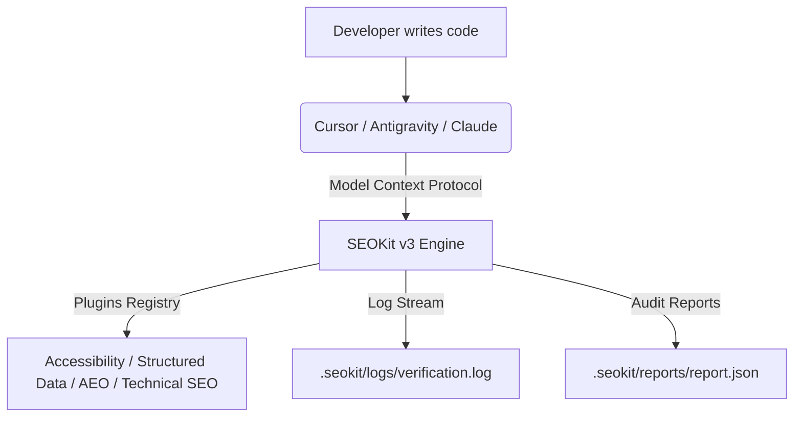

# SEOKit

Build-time SEO, performance, and accessibility validation tooling designed for AI-era search. Exposes unified verification engines, automated remediation systems, intelligence dashboards, and a complete Model Context Protocol (MCP) server environment.

---

## Architecture & Workflows



---

## CLI Execution Preview

```text
$ seokit verify

[CLI] Launching SEOKit v3 platform run against: C:\workspace\my-app
[Progress 20%] Acquiring raw resources...
[Progress 100%] Verification sweep complete.

--- Mapped IDE Diagnostics ---
✗ ERROR | Line 12:4 | Canonical link tag is missing.
⚠ WARN  | Line 48:8 | Images are missing alternative description attributes.

--- Final Verification Summary ---
Total checks: 23 | Passed: 21 | Failed: 2

[SEOKit] Exporters successfully created audit reports in: .seokit/reports
```

---

## Capabilities

1.  **Unified SEO & AEO verification**: Audits technical tags, JSON-LD schemas, Princeton GEO factors, and accessibility guidelines.
2.  **Automated Remediation Engine**: Recommends and applies code-fixes dynamically with backup snapshotting and atomic multi-file rollbacks.
3.  **MCP Server & Prompts**: Zero-config stdio server launcher with auto-registration generators for Cursor, Claude Desktop, and Antigravity.
4.  **CLI client**: Simple subcommand interface to initialize, verify, report, and fix code targets.

---

## Installation & Setup

```bash
# Install globally
npm install -g seokit

# Initialize workspace client integrations (Cursor, Antigravity, Claude Desktop)
seokit init

# Run health diagnostics checks
seokit doctor
```

---

## Subcommands

*   `seokit init [path]`: Scaffolds `.cursor/mcp.json`, `.agents/mcp.json`, and the Claude Desktop configuration files.
*   `seokit doctor [path]`: Verifies connection handshakes, node execution runtimes, and client file access configurations.
*   `seokit verify [path]`: Runs full orchestrations and outputs report exports in JSON, HTML, Markdown, and SARIF.
*   `seokit mcp`: Launches the Model Context Protocol stdio server.

---

## Active MCP Prompts

*   `audit_website`: Run SEO verification scans on a target path.
*   `fix_seo`: Optimize and apply canonical tags, title optimizers, or schema files.
*   `generate_content`: Create high-quality, keyword-focused article drafts.
*   `analyze_competitor`: Audit backlink opportunities and keyword ranking gaps.
*   `keyword_research`: Group search queries into semantic topic clusters.
*   `explain_issue`: Detailed guidance on specific rule violations.

---

## License

MIT
