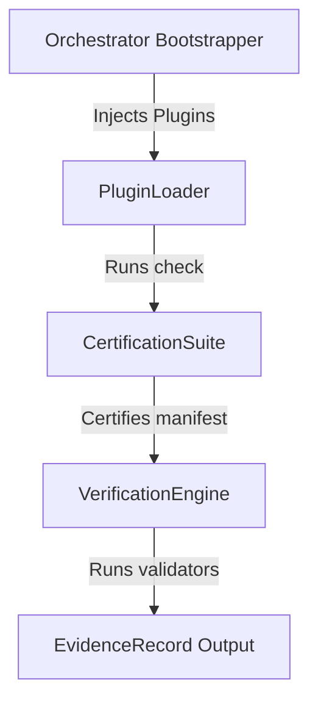

# SEOKit Architecture Handbook (v1.0.0 Stable Release)

This handbook describes the design layers, packages, and loop interactions of SEOKit. As of version 1.0.0, the core APIs, plugin loader systems, and execution protocols are frozen.

---

> [!IMPORTANT]
> **API Freeze Notice**: The public interfaces defined in `@seokit/core` (including the VerificationEngine, StorageProvider, ExecutableRule, and ReportEngine) are locked for the v1.x cycle. Changes to core logic must maintain backwards compatibility.

---

## 1. Monorepo Layer Layout

SEOKit is structured as a framework-agnostic core rules engine exposed via thin adapters:

*   **`packages/core`**: The stateless engine containing parsers, checkers, loaders, registries, and report generators. Core depends on no plugins or adapters.
*   **`packages/plugins/*`**: Capability integrations (SEO, accessibility, performance, GEO, AEO). Plugins depend on core, never core on plugins.
*   **`packages/orchestrator`**: Injects target plugins dynamically and runs the check loop.
*   **`packages/mcp`**: Model Context Protocol adapter enabling IDE agent capabilities.

---

## 2. Dynamic Execution Flow

The platform initializes and validates plugins statefully:

---

## 3. Storage Layer

SEOKit leverages file-based stores in `.seokit/`:
*   `evidence/`: Saved hashed validator outputs (`sha256(treeHash + ruleId + taskId...)`).
*   `tasks/`: Active task definitions.
*   `reports/`: Formatted HTML, markdown, JSON, or SARIF output documents.
